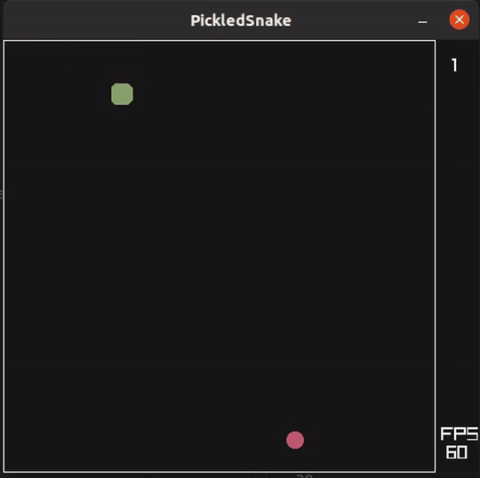

# PickledSnake game

This is a classic snake game written in *my* programming language [PickleLisp](https://github.com/Rad-hi/PickleLisp).

## Demo

  

## Why?

Because why not, and I wanted a goal to set for me to stop working on the language, and that goal was:
"Implement enough features to be able to load RayLib, and create a snake game with it."
